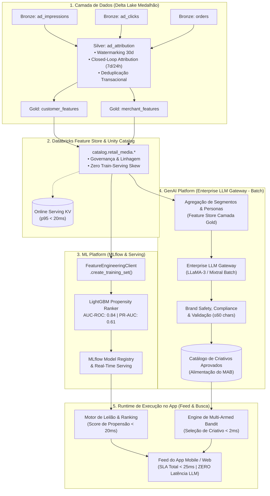

# 🚀 Plataforma de MLOps & GenAI para Retail Media em Marketplace de Quick-Commerce
## Arquitetura Unificada de Feature Store (Unity Catalog), ML Platform (MLflow) & Enterprise LLM Gateway

> **Perfil do Projeto:** Portfólio de Product Manager de Plataforma (Data, ML & GenAI Platform)  
> **Domínio de Aplicação:** Retail Media, Closed-Loop Attribution, Propensão de Compra & Dynamic Ad Creative  
> **Contexto de Mercado:** Marketplace Tier-1 de Quick-Commerce, Food & Grocery Delivery em Larga Escala  
> **Stack Tecnológica:** Databricks (Delta Lake, Unity Catalog, Feature Engineering Client, MLflow, Model Serving & Enterprise LLM Gateway)

---

## 📌 Visão Geral do Repositório

Este repositório contém a implementação completa de ponta a ponta de uma **Plataforma de Dados & Machine Learning** desenhada para resolver o triplo desafio de **Retail Media** em marketplaces de alta frequência:
1. **Trade-off de Conversão:** Maximizar a receita de publicidade patrocinada sem degradar a conversão orgânica do app.
2. **Atribuição Closed-Loop Confiável:** Conectar logs brutos de navegação (*impressions* e *clicks*) com transações de checkout em janelas temporais de 7 a 30 dias.
3. **Escala & Personalização com GenAI (Sem Overengineering):** Utilizar um **Enterprise LLM Gateway** para gerar assincronamente (em lote) variações criativas contextualizadas por persona a partir da Feature Store, populando o catálogo de **Multi-Armed Bandit (MAB)** do aplicativo com zero impacto de latência no feed (< 2ms) e custos 98% inferiores a chamadas em tempo real.

---

## 🏛️ Arquitetura da Solução



---

## 📊 Principais Indicadores de Plataforma & Negócio

| Dimensão | Métrica | Linha de Base (Silos) | Pós-Plataforma Unificada | Impacto Estratégico |
| :--- | :--- | :--- | :--- | :--- |
| **Plataforma (DevEx)** | **Time-to-Market de Modelos de ML** | 14 a 16 semanas | **2 semanas** | Redução de 85% no ciclo de entrega das squads de dados |
| **Plataforma (Qualidade)** | **Train-Serving Skew** | 18% a 22% de divergência | **0% (Inexistente)** | Lookup automatizado pela Feature Store em treino e inferência |
| **Plataforma (Operação)** | **Latência de Lookup Online (p95)** | 85ms (consultas ad-hoc) | **< 22ms** | Capacidade de consultar variáveis no leilão sem estourar SLAs |
| **Plataforma (Eficiência)** | **Reuso de Features Entre Squads** | < 10% (duplicação) | **68%** | Multi-tenancy para Food, Mercado, Retail Media e CRM |
| **GenAI Platform (SLA/Custo)** | **Latência no Caminho Crítico** | Hipótese: 350-600ms (LLM real-time) | **< 2ms (MAB Selection)** | Desacoplamento assíncrono: custo previsível (-98%) e zero risco de timeout |
| **Negócio Habilitado** | **CTR em Anúncios Patrocinados** | Baseline de leilão estático | **+28% CTR** | Ranqueamento preditivo de propensão + personalização de criativos via MAB |
| **Negócio Habilitado** | **ROAS Médio dos Anunciantes** | Baseline | **+19% ROAS** | Direcionamento preciso com base em afinidade real e sensibilidade a preço |

---

## 📂 Estrutura do Diretório

```bash
case_retail_media_mlops/
├── README.md                                  # Este documento executivo
├── LICENSE                                    # Licença de código aberto (MIT)
├── .gitignore                                 # Regras de exclusão de artefatos temporários
├── requirements.txt                           # Dependências de execução
├── docs/
│   └── case_retail_media_mlops.md             # Dossiê aprofundado com narrativa de PM e Q&A executivo
├── data/
│   ├── bronze_ad_impressions.csv              # Logs brutos de impressões (60k eventos)
│   ├── bronze_ad_clicks.csv                   # Logs brutos de cliques (6.3k eventos)
│   ├── bronze_orders.csv                      # Transações do checkout (19.7k pedidos / R$ 1.25M GMV)
│   ├── silver/
│   │   └── silver_ad_attribution.parquet      # Tabela tratada com atribuição temporal 7d/24h
│   └── gold/
│       ├── gold_customer_features.parquet     # Tabela governada de features do consumidor (5.000 perfis)
│       └── gold_merchant_features.parquet     # Tabela governada de parceiros/restaurantes (200 sellers)
└── scripts/
    ├── generate_retail_media_data.py          # Gerador sintético de alta fidelidade da camada Bronze
    ├── 01_retail_media_delta_lake.py          # Pipeline Medalhão e Atribuição Temporal (DuckDB/PySpark)
    ├── 02_retail_media_feature_store_mlflow.py # Feature Store Offline/Online + Treino LightGBM e MLflow
    └── 03_genai_dynamic_ad_copy.py            # GenAI Platform: Geração Assíncrona em Lote & Multi-Armed Bandit
```

---

## 🛠️ Como Executar os Pipelines Localmente

### 1. Instalar Dependências
```bash
pip install -r requirements.txt
```

### 2. Passo 1: Gerar a Camada Bronze (Logs Brutos)
```bash
python scripts/generate_retail_media_data.py
```
*Gera 60.000 impressões, 6.300 cliques e 19.700 pedidos simulando comportamento real de compra.*

### 3. Passo 2: Executar o Pipeline Medalhão Delta Lake
```bash
python scripts/01_retail_media_delta_lake.py
```
*Executa o join de atribuição temporal na camada Silver e materializa as tabelas Gold em Parquet.*

### 4. Passo 3: Treinar Modelo e Registrar no MLflow com Feature Store
```bash
python scripts/02_retail_media_feature_store_mlflow.py
```
*Executa o lookup offline via Feature Store, treina o LightGBM, registra métricas no MLflow e simula inferência online sem train-serving skew.*

### 5. Passo 4: Executar a Camada de GenAI Platform (Geração em Lote & Multi-Armed Bandit)
```bash
python scripts/03_genai_dynamic_ad_copy.py
```
*Gera variações criativas em lote via Enterprise LLM Gateway a partir de personas da Feature Store, aplica guardrails corporativos e simula a engine de Multi-Armed Bandit com seleção em < 2ms e benchmark de 1.000 requisições simultâneas.*

---

## 📄 Dossiê Estratégico Completo

Para uma análise aprofundada de decisões arquiteturais, governança ("Brilliant Basics"), atendimento multi-tenancy e roteiro de perguntas para entrevistas de liderança de produto, consulte o documento:  
👉 **[docs/case_retail_media_mlops.md](docs/case_retail_media_mlops.md)**
