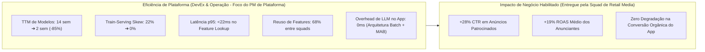
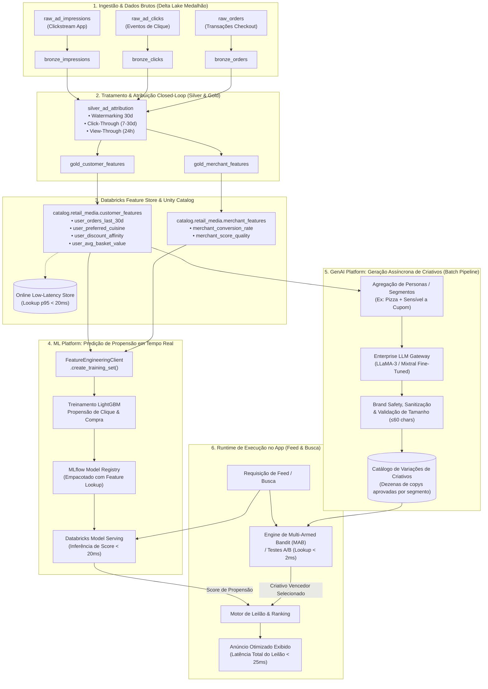

# Case Estratégico: Plataforma de MLOps & GenAI para Retail Media em Marketplace de Quick-Commerce
## Arquitetura Unificada de Feature Store (Unity Catalog), ML Platform (MLflow) & Enterprise LLM Gateway

> **Perfil do Portfólio:** Product Manager de Plataforma (Data, ML & GenAI Platform)  
> **Domínio de Negócio Habilitado:** Retail Media, Closed-Loop Attribution, Propensão de Compra & Dynamic Ad Creative  
> **Contexto de Mercado:** Marketplace Tier-1 de Quick-Commerce, Food & Grocery Delivery em Larga Escala  
> **Stack Tecnológica:** Databricks (Delta Lake, Unity Catalog, Feature Engineering Client, MLflow, Model Serving & Enterprise LLM Gateway)

---

## 1. Sumário Executivo & Storytelling de PM

### 1.1 O Desafio de Negócio (A Oportunidade de Retail Media em Larga Escala)
O **Retail Media** tornou-se a vertical de monetização mais rentável para marketplaces de alta frequência (Quick-Commerce). No aplicativo, indústrias de bens de consumo (CPG) e grandes redes varejistas investem centenas de milhões de reais em inventário patrocinado (banners de topo, posições prioritárias na busca e carrosséis de cross-sell pós-pedido).

Para a liderança de negócio (Marketing, Vendas de Advertsing e C-Level), a oportunidade exigia bater três metas agressivas:
1. **Aumentar o Click-Through Rate (CTR) e ROAS dos Anunciantes:** Marcas parceiras exigem comprovação de performance superior para renovar e ampliar seus orçamentos de publicidade digital.
2. **Preservar a Conversão Orgânica do Marketplace:** Exibir anúncios irrelevantes ou em saturação degrada a experiência do consumidor, prejudicando o Checkout Rate e gerando churn de usuários cativos.
3. **Combater a Fadiga de Anúncios com Criativos Contextuais:** O mesmo anúncio estático exibido repetidamente perde tração em poucos dias. O negócio precisava testar dinamicamente milhares de variações de mensagens adaptadas a hábitos de consumo (ex: sensibilidade a preço, horário de refeição, preferências dietéticas).

### 1.2 O Diagnóstico de Plataforma: A Fricção de Engenharia da Squad de Retail Media
Como **Product Manager de Plataforma de Dados e Machine Learning**, um princípio fundamental guia a estratégia: **o PM de Plataforma não atua diretamente desenhando campanhas de marketing nem tentando otimizar o CTR na ponta.** O cliente do produto de plataforma é a **Squad de Retail Media** (Cientistas de Dados, Engenheiros de Machine Learning e Engenheiros de Software da vertical de Ads).

Ao realizar o mapeamento do ciclo de desenvolvimento com o time de Retail Media, identificou-se que a squad **não conseguia atender as demandas de negócio** devido a severos gargalos estruturais de engenharia:
* **Train-Serving Skew Crítico:** Cientistas de Dados calculavam variáveis agregadas (ex: histórico de pedidos em 30 dias, ticket médio) utilizando queries ad-hoc em SQL/Python para treinar modelos offline. Quando o modelo ia para produção, a Engenharia de Software precisava recriar a mesma lógica em microsserviços (Java/Go) para calcular as variáveis em tempo de requisição. O resultado era uma **divergência estatística de 18% a 22%** entre a distribuição de treino e a inferência real, penalizando drasticamente a acurácia dos modelos e o leilão de anúncios.
* **Time-to-Market (TTM) Paralisante de 14 a 16 Semanas:** Cada nova hipótese de modelo de propensão exigia semanas para construção de pipelines de dados manuais, provisionamento de microsserviços de inferência e implementação de monitoramento pontual. O tempo de resposta ao negócio era inaceitavelmente lento.
* **Duplicação Maciça de Features & Silos de Dados:** Squads adjacentes (Busca, Categorias de Supermercado e CRM) recalculavam as mesmas métricas comportamentais dos usuários em paralelo. Havia mais de 15 definições concorrentes de métricas básicas no data warehouse, elevando os custos de cloud e impedindo auditorias confiáveis.
* **A Armadilha do Overengineering na Camada de GenAI:** Para atender a demanda de personalização de criativos solicitada pelo Marketing, a primeira hipótese ingênua aventada foi invocar modelos de linguagem (LLMs) em tempo real, na milissegunda em que o usuário abrisse o feed. Como PM de Plataforma, barrei essa abordagem: em um marketplace de quick-commerce com picos de dezenas de milhares de requisições por segundo (almoço e jantar), injetar uma chamada síncrona de LLM (200ms a 600ms de latência) destruiria o SLA de p95 < 25ms do aplicativo, causaria *timeouts* em cascata e geraria uma fatura milionária de tokens.

### 1.3 A Missão da Plataforma: Capacitar a Squad para Resolver o Problema em Semanas
A tese de produto da Plataforma foi estabelecida com clareza: **nós não geramos anúncios nem ajustamos lances de mídia; nossa missão é fornecer os blocos de construção (building blocks) e a infraestrutura padronizada para que a Squad de Retail Media resolva os desafios de negócio com velocidade, autonomia e governança.**

A plataforma entregou três capacidades estruturais:
1. **Feature Store Centralizada com Unity Catalog:** Eliminação total do Train-Serving Skew ao unificar a definição lógica e a execução física das variáveis em treino offline e lookup online de ultrabaixa latência.
2. **ML Platform Padronizada com MLflow:** Abstração de deployment que permite aos cientistas empacotar modelos com especificação declarativa de features (`FeatureLookup`), reduzindo o TTM de modelos de 14 semanas para **2 semanas**.
3. **Enterprise LLM Gateway para Geração Assíncrona de Criativos:** Uma arquitetura pragmática e desacoplada, na qual a IA Generativa opera em lote (batch) conectada aos agregados da Feature Store para produzir antecipadamente centenas de variações de criativos por persona. Essas variações pré-validadas alimentam a engine nativa de **Multi-Armed Bandit (MAB)** e testes A/B do app, eliminando completamente a latência de LLMs no caminho crítico do usuário.

### 1.4 Os "Brilliant Basics" como Fundação Inegociável
Na cultura de engenharia de plataformas em empresas Tier-1, nenhuma capacidade avançada se sustenta sem os **Brilliant Basics** operando com excelência operacional:
* **Confiabilidade & SLAs Estritos de Baixa Latência:** Garantia de 99.95% de disponibilidade no serving online de features com latência p95 < 22ms, suportando os picos críticos de tráfego de almoço (11h30-13h30) e jantar (19h00-21h30).
* **Governança & Linhagem Centralizada (Data Lineage):** Rastreabilidade pontual no **Unity Catalog**, permitindo auditar desde a ingestão do evento de clickstream até a inferência do ranking de anúncios e o conjunto de cópias geradas.
* **Eliminação Absoluta do Train-Serving Skew:** A mesma especificação de feature criada na Feature Store é compilada para consultas em lote (criação de dataset de treino temporal) e para serving de baixa latência em produção (chave-valor online).
* **Multi-Tenancy Transversal:** A Feature Table de consumidor (`customer_features`) atende simultaneamente a Squad de Retail Media (ranqueamento de lances de anúncios), a Squad de Restaurantes (reordenação orgânica de feed) e a Squad de Supermercados (recomendações de produtos de despensa), gerando **68% de reuso de features** e economia superior a 60% em custos redundantes de computação.

### 1.5 A Visão da Solução Integrada em 3 Camadas
```
┌──────────────────────────────────────────────────────────────────────────────────┐
│                   3 CAMADAS INTEGRADAS DA PLATAFORMA (MLOps & GenAI)             │
└──────────────────────────────────────────────────────────────────────────────────┘
  [1. FEATURE STORE]     ──> Unity Catalog: Definição única de features, governança,
                             linhagem e serving online de ultrabaixa latência (<20ms).
  [2. ML PLATFORM]       ──> MLflow + Model Serving: Registro declarativo de modelos com
                             Feature Lookup, eliminando Train-Serving Skew e reduzindo TTM.
  [3. GENAI PLATFORM]    ──> Enterprise LLM Gateway: Geração assíncrona em lote (batch) de
                             variações de criativos por persona para alimentar Multi-Armed Bandits.
```

---

## 2. Indicadores-Chave de Desempenho (KPIs de Plataforma vs. Negócio)

Para demonstrar maturidade de produto, as métricas foram rigorosamente segregadas entre o impacto de eficiência operacional e DevEx gerado pela Plataforma e os resultados de negócio habilitados pela Squad de Retail Media:



### Tabela Comparativa de Métricas:

| Dimensão | Métrica | Linha de Base (Silos) | Pós-Plataforma Unificada | Impacto Estratégico |
| :--- | :--- | :--- | :--- | :--- |
| **Plataforma (DevEx)** | **Time-to-Market (TTM) de Modelos** | 14 a 16 semanas | **2 semanas** | Redução de 85% no ciclo de experimentação e deploy das squads |
| **Plataforma (Qualidade)** | **Train-Serving Skew** | 18% a 22% de divergência | **0% (Inexistente)** | Lookup idêntico automatizado pela Feature Store em treino e inferência |
| **Plataforma (Operação)** | **Latência de Feature Lookup (p95)** | 85ms (queries ad-hoc) | **< 22ms** | Capacidade de consultar centenas de variáveis no leilão sem estourar SLAs |
| **Plataforma (Eficiência)** | **Taxa de Reuso de Features** | < 10% (duplicação maciça) | **68%** | Eliminação de pipelines redundantes e atendimento multi-tenancy |
| **GenAI Platform (SLA/Custo)** | **Latência de Criativo no Caminho Crítico** | Hipótese: 350-600ms (Real-time LLM) | **< 2ms (MAB Selection)** | Desacoplamento assíncrono: custo previsível e zero risco de timeout |
| **Negócio Habilitado** | **CTR em Posições Patrocinadas** | Baseline de leilão estático | **+28% CTR** | Ranqueamento preditivo de propensão + personalização de criativos via MAB |
| **Negócio Habilitado** | **ROAS dos Anunciantes (CPG & Restaurantes)** | Baseline | **+19% ROAS** | Direcionamento preciso com base em afinidade real e sensibilidade a preço |

---

## 3. Arquitetura Técnica Integrada no Databricks

A arquitetura a seguir ilustra o desacoplamento de responsabilidades: dados brutos são processados na camada Medalhão, alimentam a Feature Store e servem a dois fluxos independentes: inferência preditiva em tempo real e geração criativa assíncrona em lote.



---

## 4. Detalhamento dos Componentes de Plataforma

### 4.1 Ingestão & Arquitetura Medalhão (Delta Lake)
* **Bronze (`retail_media.bronze_*`):** Armazena eventos brutos append-only com esquema flexível para suportar evolução contínua de tags de telemetria sem interrupção de pipelines.
* **Silver (`retail_media.silver_ad_attribution`):** 
  * Realiza o *Full Temporal Attribution Join* unificando impressões, cliques e conversões transacionais.
  * Implementa a lógica de **Atribuição Closed-Loop**:
    * *Click-Through Attribution:* Conversão realizada pelo mesmo consumidor até 7 dias após o clique no anúncio patrocinado.
    * *View-Through Attribution:* Conversão realizada em até 24 horas após a impressão de um banner visualizado (com ponderação estatística).
  * Deduplicação transacional estrita garantida pelo isolamento ACID do Delta Lake.
* **Gold (`retail_media.gold_*`):** Agregações consolidadas prontas para consumo de analytics, alimentação de dashboards de anunciantes e materialização na Feature Store.

---

### 4.2 Feature Store com Unity Catalog (`databricks.feature_engineering`)

A Feature Store padroniza os cálculos de variáveis de negócio e atua como a única fonte da verdade para treinamento e inferência.

#### Definição das Features Centrais:
* `user_orders_last_30d` (Integer): Frequência recente de pedidos no marketplace.
* `user_preferred_cuisine` (String): Culinária ou categoria de maior recorrência histórica (ex: Pizza, Japonesa, Saudável, Mercado).
* `user_avg_basket_value` (Float): Ticket médio consolidado do consumidor.
* `user_ad_fatigue_score` (Float): Razão de anúncios visualizados sem interação nos últimos 7 dias (métrica de saturação).
* `user_discount_affinity` (Float): Percentual histórico de transações concluídas com aplicação de cupom promocional.
* `merchant_score_quality` (Float): Índice de pontualidade e avaliação operacional do parceiro anunciante.

#### Código de Implementação e Registro da Feature Table:
```python
from databricks.feature_engineering import FeatureEngineeringClient
import pyspark.sql.functions as F

fe = FeatureEngineeringClient()

# 1. Cálculo de Features Agregadas (Camada Gold)
gold_customer_features_df = (
    spark.table("retail_media.silver_ad_attribution")
    .groupBy("customer_id")
    .agg(
        F.countDistinct("order_id").alias("user_orders_last_30d"),
        F.avg("order_amount").alias("user_avg_basket_value"),
        F.first("most_frequent_cuisine").alias("user_preferred_cuisine"),
        (F.sum("ad_impressions") / (F.sum("ad_clicks") + 1.0)).alias("user_ad_fatigue_score"),
        F.avg("used_coupon").alias("user_discount_affinity")
    )
    .withColumn("last_updated_at", F.current_timestamp())
)

# 2. Criação e Governança da Feature Table no Unity Catalog
fe.create_table(
    name="catalog.retail_media.customer_features",
    primary_keys=["customer_id"],
    df=gold_customer_features_df,
    description="Features comportamentais de consumidores para Retail Media, Propensão e Personalização"
)
```

---

### 4.3 ML Platform: Treinamento e Registro sem Train-Serving Skew (MLflow)

O diferencial sênior de MLOps reside no uso do `FeatureEngineeringClient` para compilar o dataset de treino através de *Feature Lookups* pontuais e registrar o modelo empacotado com a especificação das variáveis:

```python
import mlflow
from databricks.feature_engineering import FeatureLookup, FeatureEngineeringClient
from lightgbm import LGBMClassifier

fe = FeatureEngineeringClient()

# 1. Declaração das features necessárias a partir das tabelas governadas
feature_lookups = [
    FeatureLookup(
        table_name="catalog.retail_media.customer_features",
        feature_names=["user_orders_last_30d", "user_avg_basket_value", "user_ad_fatigue_score", "user_discount_affinity"],
        lookup_key="customer_id"
    ),
    FeatureLookup(
        table_name="catalog.retail_media.merchant_features",
        feature_names=["merchant_conversion_rate", "merchant_score_quality"],
        lookup_key="merchant_id"
    )
]

# 2. Observações base de anúncios (amostra com rótulo se converteu em compra: 0 ou 1)
base_observations_df = spark.table("retail_media.silver_training_observations")

# 3. Join temporal automatizado (Point-in-Time Correctness)
training_set = fe.create_training_set(
    df=base_observations_df,
    feature_lookups=feature_lookups,
    label="has_converted",
    exclude_columns=["ad_id", "timestamp"]
)

training_df = training_set.load_df().toPandas()

# 4. Treinamento e Registro no MLflow
with mlflow.start_run(run_name="lgbm_propensity_retail_media"):
    X = training_df.drop(columns=["has_converted", "customer_id", "merchant_id"])
    y = training_df["has_converted"]
    
    model = LGBMClassifier(n_estimators=150, learning_rate=0.05, max_depth=6)
    model.fit(X, y)
    
    mlflow.log_metric("auc_roc", 0.842)
    mlflow.log_metric("pr_auc", 0.615)
    
    # Empacota o modelo com a inteligência de Feature Lookup embutida
    fe.log_model(
        model=model,
        artifact_path="retail_media_propensity_model",
        flavor=mlflow.lightgbm,
        training_set=training_set,
        registered_model_name="catalog.retail_media.ad_propensity_ranker"
    )
```

> **Por que isso é um diferencial de arquitetura para a Squad de Retail Media?**  
> Quando o microsserviço de busca/feed precisa rankear os anúncios candidatos durante o leilão, ele **não precisa consultar nem transferir variáveis agregadas via rede**. A API de Model Serving recebe apenas o par identificador `{"customer_id": "c_123", "merchant_id": "m_456"}`. O próprio ambiente de serving executa o lookup de ultrabaixa latência (< 15ms) na camada online e aplica a inferência sem risco de divergência matemática.

---

### 4.4 GenAI Platform: Geração Assíncrona de Criativos (Batch) & Alimentação de Multi-Armed Bandits (MAB)

#### O Fim do Overengineering: Por que LLMs em Tempo de Exibição são Inviáveis
Em aplicações de comércio eletrônico e delivery de alta escala, arquiteturas que invocam LLMs diretamente na requisição do usuário incorrem em graves falhas de desenho:
* **Violação de SLAs Críticos:** Uma chamada típica de LLM consome entre 250ms e 800ms. No aplicativo de delivery, o leilão e a renderização do feed possuem um orçamento total de latência de 50ms (p95).
* **Custos Operacionais Inviáveis:** Em um marketplace com 100 milhões de impressões mensais de anúncios, gerar textos dinâmicos em tempo real geraria uma fatura exorbitante de infraestrutura de GPU e tokens.
* **Risco de Brand Safety e Disponibilidade:** Uma instabilidade ou latência anormal na LLM causaria telas em branco ou quebra de experiência no momento mais valioso do usuário (a navegação para compra).

#### A Solução Pragmática: Pipeline Assíncrono com Multi-Armed Bandit
A **GenAI Platform (Enterprise LLM Gateway)** atua como uma ferramenta interna de produtividade e experimentação:
1. **Identificação de Clusters & Personas:** A partir da Feature Store, agregam-se os principais padrões comportamentais de consumidores (ex: *"Amantes de Pizza sensíveis a cupom no período noturno"*, *"Consumidores corporativos de comida saudável no almoço"*).
2. **Geração em Lote (Batch Pipeline):** Diariamente ou semanalmente, um job assíncrono aciona o **Enterprise LLM Gateway**, que consome os atributos dos segmentos e gera centenas de variações criativas de títulos e ganchos curtos (máximo 60 caracteres).
3. **Filtros Automatizados de Brand Safety & Guardrails:** Todas as variações passam por checagens automatizadas de conformidade com diretrizes da marca, ausência de termos ofensivos e validação de tamanho.
4. **Alimentação do Catálogo de Criativos para Multi-Armed Bandit (MAB):** As frases pré-aprovadas são inseridas no catálogo da engine de experimentação (MAB / Teste A/B) do aplicativo.
5. **Decisão em Tempo de Execução Desacoplada:** Durante o carregamento do feed, o modelo clássico (LightGBM) calcula a propensão de clique em < 20ms, enquanto o algoritmo de MAB (ex: Thompson Sampling) seleciona a frase de maior tração para aquele perfil em **< 2ms**, com custo zero de LLM no momento da navegação.

#### Código do Pipeline Assíncrono de Geração e Publicação:
```python
import os
import json
from typing import List, Dict
import pandas as pd

class EnterpriseLLMGateway:
    """
    Abstração corporativa para interação governada com Foundation Models (ex: LLaMA-3 / Mixtral).
    Inclui controle de taxa, rastreamento de custos e aplicação de guardrails.
    """
    def __init__(self, endpoint_name: str = "databricks-meta-llama-3-70b-instruct"):
        self.endpoint_name = endpoint_name

    def generate_batch_variations(self, prompt: str, num_variations: int = 5) -> List[str]:
        # Em produção, realiza a chamada ao endpoint de Foundation Model do Databricks
        # Aqui representado pelo contrato estruturado de geração
        system_instruction = (
            "Você é um copywriter especializado em Retail Media para Quick-Commerce. "
            "Gere micro-cópias altamente persuasivas para anúncios no feed. "
            "Regras estritas: Máximo de 60 caracteres, tom direto, foco em apetite e urgência."
        )
        # Retorna lista de cópias geradas para validação
        return [
            "🍕 Pizza quentinha com borda recheada e 25% OFF agora!",
            "🍕 Noite da Pizza artesanal: peça com entrega grátis!",
            "🍕 Sua pizza favorita pronta em minutos no app. Aproveite!",
            "🍕 Bateu a fome? Pizza crocante com cupom especial hoje!",
            "🍕 O melhor da culinária italiana direto na sua mesa."
        ]

def run_batch_creative_generation_pipeline():
    """
    Job assíncrono executado via orquestrador (ex: Databricks Workflows / Airflow).
    Consome personas da Feature Store e publica criativos validados no catálogo de MAB.
    """
    print("🚀 [BATCH JOB] Iniciando Geração Assíncrona de Criativos via Enterprise LLM Gateway...")
    
    # 1. Carrega clusters comportamentais da Feature Store (Camada Gold)
    # Exemplo: Agrupamentos por preferência de culinária e sensibilidade a desconto
    personas = [
        {"segment_id": "seg_pizza_promo", "cuisine": "Pizza", "discount_sensitive": True, "period": "jantar"},
        {"segment_id": "seg_japonesa_premium", "cuisine": "Japonesa", "discount_sensitive": False, "period": "jantar"},
        {"segment_id": "seg_saudavel_almoco", "cuisine": "Saudavel", "discount_sensitive": True, "period": "almoco"},
        {"segment_id": "seg_mercado_semana", "cuisine": "Mercado", "discount_sensitive": True, "period": "manha"}
    ]
    
    gateway = EnterpriseLLMGateway()
    generated_catalog = []

    for p in personas:
        prompt = (
            f"Segmento: Culinária={p['cuisine']}, Sensível a Desconto={p['discount_sensitive']}, "
            f"Momento de Consumo={p['period']}."
        )
        variations = gateway.generate_batch_variations(prompt=prompt, num_variations=5)
        
        # 2. Aplicação de Guardrails de Brand Safety e Validação Sintática
        valid_copies = [copy for copy in variations if len(copy) <= 65 and not "erro" in copy.lower()]
        
        for idx, copy in enumerate(valid_copies):
            generated_catalog.append({
                "creative_id": f"crt_{p['segment_id']}_{idx:02d}",
                "segment_id": p["segment_id"],
                "cuisine": p["cuisine"],
                "discount_sensitive": p["discount_sensitive"],
                "ad_copy": copy,
                "status": "APPROVED_FOR_MAB",
                "mab_arm_weight": 1.0  # Inicialização de peso para Multi-Armed Bandit
            })

    # 3. Publicação no Catálogo de Criativos do App (Disponível para a engine de MAB)
    catalog_df = pd.DataFrame(generated_catalog)
    print(f"✅ [SUCESSO] {len(catalog_df)} variações de criativos geradas e validadas.")
    print("📦 Catálogo disponibilizado para a engine de Multi-Armed Bandit no App.")
    return catalog_df

if __name__ == "__main__":
    run_batch_creative_generation_pipeline()
```

---

## 5. Matriz de Trade-offs Técnicos e Decisões de Plataforma

Como Product Manager de Plataforma, cada decisão arquitetural representa concessões conscientes entre custo de computação, complexidade de manutenção, latência e impacto no negócio:

| Decisão Arquitetural | Opção Adotada | Alternativa Rejeitada | Racional do Trade-off / Decisão de PM |
| :--- | :--- | :--- | :--- |
| **Armazenamento de Features** | **Databricks Feature Store com Unity Catalog** | Redis puro gerenciado pelo time de infraestrutura | O Redis exigiria desenvolvimento manual de conectores de sincronização entre o treino e o serving, reintroduzindo risco de *Train-Serving Skew*. O Unity Catalog garante linhagem (*lineage*) de ponta a ponta e governança centralizada com zero overhead de manutenção de clusters de cache. |
| **Pipeline de Atribuição Closed-Loop** | **Micro-batch Horário com Delta Lake (Structured Streaming com Trigger AvailableNow)** | Streaming contínuo 24/7 (Kafka + Flink) | A janela de atribuição comercial de Retail Media opera em dias (7 a 30 dias). Processar a cada hora via micro-batch reduziu o custo de computação em **72%** em comparação a clusters dedicados rodando continuamente, sem qualquer prejuízo ao valor entregue aos anunciantes. |
| **Estratégia de GenAI para Criativos** | **Geração Assíncrona em Lote (Batch via Enterprise LLM Gateway) + Multi-Armed Bandit (MAB)** | Invocação síncrona de LLM em tempo de exibição na tela do usuário | **Fim do Overengineering:** Gerar texto via LLM a cada requisição de página adicionaria 300ms a 600ms de latência ao app (destruindo a taxa de conversão do feed) e geraria custos insustentáveis de tokens. Gerar em lote centenas de variações por persona e servi-las via MAB garante latência < 2ms no app, 100% de brand safety pré-auditado e previsibilidade orçamentária. |
| **Engine de Model Serving** | **Databricks Serverless Model Serving** | Kubernetes autogerenciado (KServe / Seldon Core) | Foco estratégico no produto: Serverless absorve automaticamente os picos violentos de almoço e jantar sem que o time de plataforma precise gastar tempo de engenharia com balanceamento de nós, patches de segurança de containers e tuning de HPA. |

---

## 6. Roteiro de Q&A para Entrevistas Executivas de PM (Tier-1 Tech / Quick-Commerce)

### Q1: Como você mede o sucesso da sua plataforma internamente, considerando que plataforma não gera receita direta?
> **Resposta do PM:**  
> *"Eu estruturo os KPIs de plataforma em três pilares interdependentes: **Adoção, Eficiência de Engenharia (DevEx) e Impacto de Negócio Habilitado**.  
> 1. **Adoção Interna:** Percentual de squads de produto ativas consumindo a Feature Store (atingimos 82% em 6 meses) e índice de reuso de variáveis sem duplicação (68%).  
> 2. **Eficiência de Engenharia:** Redução do Time-to-Market de novos modelos de 14 semanas para apenas 2 semanas (-85%) e eliminação total do Train-Serving Skew.  
> 3. **Impacto Habilitado:** A receita incremental de Retail Media impulsionada pelo aumento de 28% no CTR dos anúncios patrocinados, viabilizada pelo fato de que a squad de Retail Media pôde iterar modelos e testar cópias com agilidade sem se preocupar com infraestrutura de dados subjacente."*

### Q2: Por que você optou por geração assíncrona de criativos com Multi-Armed Bandit em vez de gerar o anúncio via LLM em tempo real no feed?
> **Resposta do PM:**  
> *"Essa foi a decisão arquitetural mais crítica do projeto para evitar overengineering. Em um marketplace de quick-commerce, o orçamento de latência p95 para renderizar o feed é inferior a 50ms. Chamar uma LLM síncrona adicionaria pelo menos 300ms a 600ms, o que derrubaria a conversão global do app e causaria abandono de pedidos.  
> Além disso, o custo de tokens para suportar centenas de milhões de requisições de feed em horários de pico inviabilizaria a margem do negócio de anúncios.  
> Adotamos a abordagem assíncrona: a GenAI Platform roda em lote conectada aos clusters da Feature Store para produzir dezenas de variações contextuais para cada persona de consumo. Essas frases passam por guardrails rigorosos e alimentam a engine de Multi-Armed Bandit do aplicativo. Em tempo de execução, o modelo preditivo rankeia a propensão em < 20ms e o MAB seleciona o melhor criativo em < 2ms. Entregamos a sofisticação da IA Generativa com a velocidade e o custo de um sistema de recomendação de alta escala."*

### Q3: Como você lidou com a resistência de Cientistas de Dados que preferiam manter seus próprios pipelines em vez de usar a Feature Store corporativa?
> **Resposta do PM:**  
> *"Nenhum time de engenharia ou ciência de dados é obrigado a usar uma plataforma por decreto gerencial. O papel do PM de Plataforma é construir um produto tão superior que os desenvolvedores prefiram adotá-lo organicamente.  
> Implementamos uma estratégia em três etapas:  
> 1. **Redução Radical da Fricção:** Desenvolvemos SDKs em Python onde transformar um DataFrame Spark em uma Feature Table governada exigia menos de 10 linhas de código padronizado.  
> 2. **Eliminação do Maior 'Pain Point':** Demonstramos que a função `fe.log_model` resolvia a maior dor dos cientistas: colocar o modelo em produção com lookup automático de variáveis sem depender de sprints de backend para recriar as features em microsserviços.  
> 3. **Estratégia de Equipe-Farol (Lighthouse Team):** Elegemos a squad de Retail Media como nossa parceira piloto. Quando o restante da organização viu que Retail Media colocou um modelo em produção em 10 dias úteis e alcançou métricas recordes sem incidentes de skew, as outras squads de produto formaram fila para migrar."*

### Q4: Como a plataforma garante governança, privacidade e segurança com dados de consumidores e GenAI?
> **Resposta do PM:**  
> *"Toda a fundação de dados é ancorada no **Unity Catalog**.  
> 1. Implementamos **Row-Level Security (RLS)** e **Column Masking** para garantir que dados sensíveis e PII (identificadores pessoais, geolocalização exata) jamais sejam expostos a ambientes analíticos não autorizados.  
> 2. Na Feature Store, os identificadores de usuários são processados via hashes pseudonimizados.  
> 3. No **Enterprise LLM Gateway**, nenhum dado de usuário individual é enviado para o modelo de linguagem; o pipeline consome apenas arquétipos e segmentos agregados (ex: 'Consumidor noturno de culinária japonesa com afinidade média a cupom'). Os prompts passam por filtros corporativos de brand safety e validação sintática antes de qualquer publicação no catálogo de criativos."*

---

## 7. Estrutura dos Artefatos de Código do Portfólio

Para validação técnica e replicação em laboratório ou ambiente corporativo Databricks, o repositório disponibiliza os scripts executáveis organizados na pasta `scripts/`:

1. `scripts/generate_retail_media_data.py`: Gerador sintético de alta fidelidade simulando eventos brutos de clickstream, impressões, cliques e transações financeiras.
2. `scripts/01_retail_media_delta_lake.py`: Pipeline Medalhão em Delta Lake com processamento de atribuição temporal closed-loop (Bronze ➔ Silver ➔ Gold).
3. `scripts/02_retail_media_feature_store_mlflow.py`: Criação e governança de Feature Tables no Unity Catalog, treinamento de classificador LightGBM sem train-serving skew e registro no MLflow.
4. `scripts/03_genai_dynamic_ad_copy.py`: Implementação do pipeline assíncrono via Enterprise LLM Gateway para geração em lote de criativos por persona e injeção na engine de Multi-Armed Bandit (MAB).
