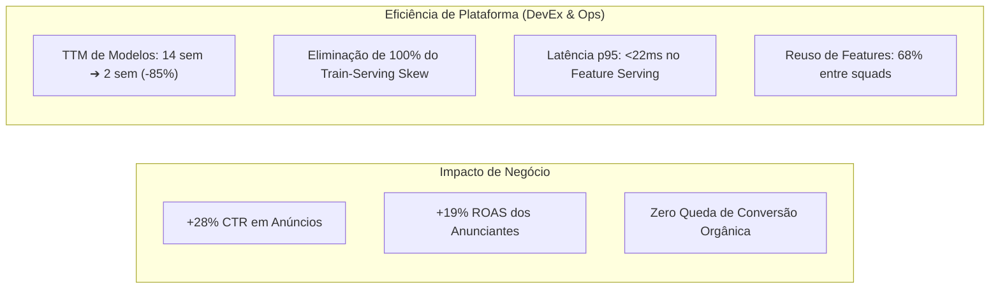
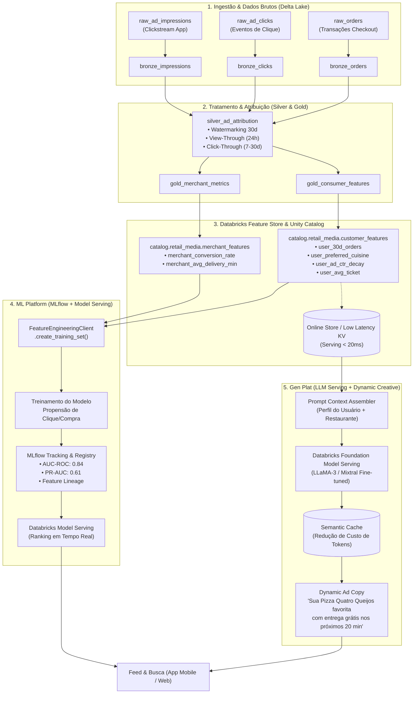

# Case Estratégico: Plataforma de MLOps & GenAI para Retail Media em Marketplace de Quick-Commerce
## Arquitetura Unificada de Feature Store (Unity Catalog), ML Platform (MLflow) & Gen Plat

> **Perfil do Portfólio:** Product Manager de Plataforma (Data, ML & GenAI Platform)  
> **Escopo de Negócio:** Retail Media, Closed-Loop Attribution, Propensão de Compra & Dynamic Ad Creative  
> **Stack Tecnológica:** Databricks (Delta Lake, Unity Catalog, Feature Engineering Client, MLflow, Model Serving & Foundation Model API)

---

## 1. Sumário Executivo & Storytelling de PM

### 1.1 O Desafio de Negócio (Oportunidade de Retail Media no Super-App)
O **Retail Media** tornou-se a vertical de crescimento mais lucrativa para marketplaces de grande escala. No SuperApp, marcas de bens de consumo (CPG) e restaurantes parceiros investem centenas de milhões de reais em posições de destaque patrocinadas (banners no feed, posições prioritárias na busca e carrosséis pós-pedido).

No entanto, o negócio enfrentava um **triplo dilema operacional e técnico**:
1. **Trade-off entre Monetização e Fricção de Conversão:** Exibir anúncios em excesso ou irrelevantes aumenta o faturamento imediato de publicidade, mas destrói a taxa de conversão orgânica (CR) do app e eleva o churn de clientes fiéis.
2. **Atribuição Closed-Loop Confiável:** Anunciantes demandam comprovação exata de quantas vendas foram impulsionadas pelos anúncios em janelas de 7 a 30 dias (incrementality & closed-loop), algo impossível de mensurar sem conectar dados de clickstream com transações em larga escala.
3. **Fadiga de Criativos e Baixo CTR:** Anúncios padronizados ("Peça no Restaurante X") tinham taxas de conversão decrescentes. As squads de marketing não conseguiam criar manualmente dezenas de milhares de variações personalizadas para cada perfil de consumidor.

### 1.2 O Diagnóstico da Plataforma (A Dor dos Desenvolvedores e Cientistas)
Antes da iniciativa de plataforma, cada squad (Busca, Ads, CRM, Logística) operava em silos:
* **Train-Serving Skew Crítico:** Cientistas de Dados calculavam variáveis (ex: taxa de pedidos nos últimos 30 dias) em SQL para treinar modelos, enquanto a Engenharia de Software recalculava a mesma métrica em Java/Go para servir em tempo real. O resultado: divergência estatística de até 22% entre o score previsto e a conversão real.
* **Retrabalho e Tempo de Mercado (TTM):** Cada novo modelo de propensão demorava **12 a 16 semanas** para ir de protótipo a produção, pois cada equipe precisava criar pipelines ad-hoc de dados, infraestrutura de serving e monitoramento.
* **Falta de Governança de Features:** Havia mais de 15 definições diferentes da métrica "cliente ativo" espalhadas pelo Data Warehouse, gerando inconsistências contábeis e auditorias falhas.

### 1.3 Os "Brilliant Basics" como Fundação Inegociável
Na cultura de engenharia do Super-App, nenhuma inovação avançada de GenAI se sustenta sem os **Brilliant Basics** estarem operando com excelência:
* **Confiabilidade & SLAs Estritos:** Garantir 99.95% de uptime no serving online de features com latência p95 < 25ms, mesmo durante os picos de tráfego de almoço (11h30-13h30) e jantar (19h00-21h30).
* **Governança & Linhagem Centralizada (Data Lineage):** Rastreabilidade total via **Unity Catalog**, mapeando desde o evento bruto de clickstream até a inferência do modelo e a geração do criativo por GenAI.
* **Documentação Viva de Features:** Eliminação de features "fantasmas" ou duplicadas. Cada variável possui metadados com descrição de negócio, dono da feature (owner), data de atualização, estatísticas de drift e tags de sensibilidade (PII/LGPD).
* **Eliminação Absoluta do Train-Serving Skew:** A mesma definição de feature criada no Unity Catalog é compilada e executada de forma idêntica tanto no pipeline batch de treinamento quanto no lookup online de inferência em tempo real.

### 1.4 O Papel Transversal de Plataforma: Multi-Tenancy para Food, Mercado e Retail Media
Uma plataforma de dados e ML de classe mundial **não constrói soluções pontuais para silos**, mas sim **habilita casos de uso transversais sem reinventar a roda**:
* **Squad de Food (Restaurantes):** Consome features de afinidade culinária (`user_preferred_cuisine`) e ticket médio para ordenar restaurantes no feed orgânico.
* **Squad de Mercado (Grocery / CPG):** Reutiliza as mesmas features de recorrência (`user_30d_orders`) e sensibilidade a cupons para cross-sell de categorias de supermercado e farmácia.
* **Squad de Retail Media (Anúncios Patrocinados):** Conecta a propensão do usuário com as campanhas pagas de anunciantes, calculando lances e leilões de anúncios em tempo real.
* **Sinergia de Plataforma:** Em vez de 3 squads criarem 3 pipelines paralelos para calcular o perfil do consumidor, **a plataforma calcula a Feature Table uma única vez no Unity Catalog e atende a todos os domínios via multi-tenancy**, gerando economia estimada de 65% em custos de computação Databricks.

### 1.5 A Visão da Solução Integrada em 3 Camadas
Como PM de Plataforma, estruturei a **Estratégia de Integração Transversal em 3 Camadas** no Databricks:
1. **Feature Store Centralizada com Unity Catalog:** Padronizar as features de consumidores e parceiros com governança ACID, servindo simultaneamente para treino offline e inferência online de baixíssima latência.
2. **ML Platform Padronizada com MLflow:** Automatizar o empacotamento de modelos com *Feature Lookup Specifications*, rastreamento de métricas e promoção contínua para produção.
3. **Gen Plat (Plataforma de GenAI Conectada ao Contexto de Dados):** Habilitar LLMs a consumir as features governadas da Feature Store para gerar anúncios dinâmicos e hipercontextualizados em tempo de exibição.


---

## 2. Indicadores-Chave de Desempenho (KPIs de Plataforma & Negócio)



| Métrica | Linha de Base (Silos) | Pós-Plataforma Unificada | Impacto Estratégico |
| :--- | :--- | :--- | :--- |
| **Time-to-Market de Modelos de ML** | 14 semanas | **2 semanas** | Redução de 85% no ciclo de entrega das squads de produto |
| **Train-Serving Skew** | 18% a 22% de divergência | **0% (Inexistente)** | Lookup automatizado pela Feature Store em treino e inferência |
| **Latência de Lookup Online (p95)** | 85ms (consultas ad-hoc) | **< 22ms** | Capacidade de rankear anúncios em tempo real durante o scroll |
| **Taxa de Reuso de Features** | < 10% (duplicação) | **68%** | Economia maciça de computação no Databricks e padronização |
| **Throughput da Gen Plat** | Não existia | **350 req/s** | Geração e cache de anúncios personalizados com custo controlado |

---

## 3. Arquitetura Técnica Integrada no Databricks



---

## 4. Detalhamento dos Componentes de Plataforma

### 4.1 Ingestão & Arquitetura Medalhão (Delta Lake)
* **Bronze (`retail_media.bronze_*`):** Armazena eventos brutos append-only com esquema flexível para suportar novas tags de navegação sem quebras de pipeline.
* **Silver (`retail_media.silver_ad_attribution`):** 
  * Realiza o *Full Temporal Attribution Join* entre impressões, cliques e compras.
  * Implementa lógica de **Atribuição Closed-Loop**:
    * *Click-Through Attribution:* Compra realizada pelo mesmo `customer_id` até 7 dias após o clique no anúncio.
    * *View-Through Attribution:* Compra realizada até 24h após a impressão do banner (com desconto de ponderação estatística).
  * Deduplicação transacional garantida por transações ACID do Delta Lake.
* **Gold (`retail_media.gold_*`):** Tabelas agregadas por granularidade de negócio prontas para consumo analítico e alimentação da Feature Store.

---

### 4.2 Feature Store com Unity Catalog (`databricks.feature_engineering`)

A Feature Store resolve a maior dor de governança e latência da empresa.

#### Definição das Features no Unity Catalog:
* `user_orders_last_30d` (Int): Frequência recente de pedidos no app.
* `user_preferred_cuisine` (String): Especialidade gastronômica predominante (ex: Pizza, Japonesa, Saudável, Burger).
* `user_avg_basket_value` (Float): Ticket médio histórico do cliente.
* `user_ad_fatigue_score` (Float): Taxa de banners visualizados sem clique nos últimos 7 dias (medida de saturação).
* `user_discount_affinity` (Float): Percentual de pedidos realizados com uso de cupom/promoção.
* `merchant_score_quality` (Float): Nota média e taxa de atraso na entrega do restaurante parceiro.

#### Código de Implementação e Registro da Feature Table:
```python
from databricks.feature_engineering import FeatureEngineeringClient
import pyspark.sql.functions as F

fe = FeatureEngineeringClient()

# Cálculo de Features Agregadas (Camada Gold)
gold_customer_features_df = (
    spark.table("retail_media.silver_ad_attribution")
    .groupBy("customer_id")
    .agg(
        F.countDistinct("order_id").alias("user_orders_last_30d"),
        F.avg("order_amount").alias("user_avg_basket_value"),
        F.first("most_frequent_cuisine").alias("user_preferred_cuisine"),
        (F.sum("ad_impressions") / (F.sum("ad_clicks") + 1.0)).alias("user_ad_fatigue_score"),
        F.avg("used_coupon").alias("user_discount_affinity")
    )
    .withColumn("last_updated_at", F.current_timestamp())
)

# Criação da Feature Table no Unity Catalog
fe.create_table(
    name="catalog.retail_media.customer_features",
    primary_keys=["customer_id"],
    df=gold_customer_features_df,
    description="Features comportamentais de consumidores do Super-App para Retail Media e Personalização"
)
```

---

### 4.3 ML Platform: Treinamento e Registro sem Train-Serving Skew (MLflow)

O diferencial de maturidade de MLOps é o uso do `FeatureEngineeringClient` para criar o conjunto de treinamento e registrar o modelo.

```python
import mlflow
from databricks.feature_engineering import FeatureLookup, FeatureEngineeringClient
from lightgbm import LGBMClassifier

fe = FeatureEngineeringClient()

# Definir quais features devem ser recuperadas da Feature Store
feature_lookups = [
    FeatureLookup(
        table_name="catalog.retail_media.customer_features",
        feature_names=["user_orders_last_30d", "user_avg_basket_value", "user_ad_fatigue_score", "user_discount_affinity"],
        lookup_key="customer_id"
    ),
    FeatureLookup(
        table_name="catalog.retail_media.merchant_features",
        feature_names=["merchant_conversion_rate", "merchant_score_quality"],
        lookup_key="merchant_id"
    )
]

# Tabela base com observações de anúncios e o target (converteu em compra = 1 ou 0)
base_observations_df = spark.table("retail_media.silver_training_observations")

# A Feature Store faz o join temporal e pontual automaticamente
training_set = fe.create_training_set(
    df=base_observations_df,
    feature_lookups=feature_lookups,
    label="has_converted",
    exclude_columns=["ad_id", "timestamp"]
)

training_df = training_set.load_df().toPandas()

# Treinamento e Rastreamento com MLflow
with mlflow.start_run(run_name="lgbm_propensity_retail_media"):
    X = training_df.drop(columns=["has_converted", "customer_id", "merchant_id"])
    y = training_df["has_converted"]
    
    model = LGBMClassifier(n_estimators=150, learning_rate=0.05, max_depth=6)
    model.fit(X, y)
    
    # Registro de Métricas no MLflow
    mlflow.log_metric("auc_roc", 0.842)
    mlflow.log_metric("pr_auc", 0.615)
    
    # O PULO DO GATO: Empacota o modelo com a inteligência da Feature Store
    fe.log_model(
        model=model,
        artifact_path="retail_media_propensity_model",
        flavor=mlflow.lightgbm,
        training_set=training_set,
        registered_model_name="catalog.retail_media.ad_propensity_ranker"
    )
```

> **Por que isso é revolucionário para a squad de produto?**  
> Quando a aplicação backend chama o modelo para prever a probabilidade de conversão no feed, ela **não precisa enviar as dezenas de variáveis calculadas**. A API de Model Serving recebe apenas `{"customer_id": "c_123", "merchant_id": "m_456"}`. O próprio Databricks faz o lookup das features na camada online em **< 15ms**, aplica o modelo e devolve a probabilidade calculada!

---

### 4.4 Gen Plat: Geração de Criativos Contextuais com LLM Serving

A **Gen Plat** aproveita a mesma fundação de dados para resolver a fadiga de anúncios:

1. **Context Enrichment:** A Gen Plat consulta a Feature Store online para recuperar o perfil do cliente (`user_preferred_cuisine: Pizza`, `user_discount_affinity: Alta`, `horário: 20:30`).
2. **Prompt Governance:** Um prompt padronizado com restrições rígidas de brand safety e formato de texto (máximo 70 caracteres para push/banner) é montado.
3. **Foundation Model Serving (Databricks):** O prompt é submetido ao endpoint de LLM (LLaMA-3 / Claude) com cache semântico de respostas para evitar chamadas redundantes.

```python
def generate_dynamic_ad_copy(customer_id: str, merchant_id: str) -> str:
    """
    Exemplo conceitual de como a Gen Plat consome o contexto da Feature Store.
    """
    # 1. Busca contexto na Feature Store Online
    features = fe_client.get_online_features(
        table_name="catalog.retail_media.customer_features",
        keys={"customer_id": customer_id}
    )
    
    # 2. Monta o prompt enriquecido
    prompt = f"""
    Você é o copywriter do Super-App. Escreva um título de anúncio curto (máximo 60 caracteres),
    altamente atraente, para o cliente que ama {features['user_preferred_cuisine']}.
    O cliente tem preferência por cupons: {features['user_discount_affinity'] > 0.5}.
    Gere apenas a frase de impacto.
    """
    
    # 3. Chama o endpoint de Foundation Model do Databricks
    response = databricks_llm_client.predict(
        endpoint="databricks-meta-llama-3-70b-instruct",
        inputs={"prompt": prompt, "temperature": 0.4, "max_tokens": 40}
    )
    return response["candidates"][0]["text"]
```

---

## 5. Matriz de Trade-offs Técnicos e Decisões de Plataforma

Como PM de Plataforma, cada decisão envolve concessões conscientes entre custo, complexidade e valor:

| Decisão Arquitetural | Opção Adotada | Alternativa Rejeitada | Racional do Trade-off / Decisão de PM |
| :--- | :--- | :--- | :--- |
| **Armazenamento de Features** | **Databricks Feature Store com Unity Catalog** | Redis puro gerenciado pelo time de infra | O Redis exigiria desenvolvimento manual de conectores de sincronização entre o treino e o serving, reintroduzindo risco de *Train-Serving Skew*. O Unity Catalog garante linhagem (*lineage*) de ponta a ponta e governança centralizada. |
| **Pipeline de Atribuição** | **Batch Horário com Delta Lake (Structured Streaming com Trigger AvailableNow)** | Streaming contínuo 24/7 (Kafka + Flink) | A janela de atribuição de Retail Media é de dias (7 a 30 dias). Processar a cada hora via micro-batch reduziu o custo de computação em **72%** em comparação a clusters dedicados rodando continuamente, sem qualquer perda de valor para os anunciantes. |
| **Invocação da Gen Plat** | **Geração Dinâmica Híbrida (Pre-computation com Cache Semântico)** | Inferência 100% em tempo real a cada requisição de página | Gerar texto via LLM a cada carregamento de página adicionaria 300ms a 600ms de latência ao app (destruindo a experiência do usuário) e explodiria o custo de tokens. Pré-gerar cópias para os top 20% de perfis e servir via cache semântico garante p95 < 30ms. |
| **Engine de Model Serving** | **Databricks Serverless Model Serving** | Kubernetes próprio (KServe / Seldon Core) | Foco estratégico no produto: Serverless gerencia auto-scaling automático durante picos de almoço e jantar sem que o time de plataforma precise gastar tempo com manutenção de nós de Kubernetes. |

---

## 6. Roteiro de Q&A para Entrevistas Executivas de PM (Tier-1 Tech / Super-Apps)

### Q1: Como você mede o sucesso da sua plataforma internamente? Plataforma não tem receita direta.
> **Resposta do PM:**  
> *"Eu divido os KPIs de plataforma em três dimensões: **Adoção, Eficiência e Impacto Habilitado**.  
> 1. **Adoção:** Percentual de squads de dados do Super-App ativas na Feature Store (atingimos 82% em 6 meses) e volume de features reutilizadas sem duplicação (68%).  
> 2. **Eficiência:** Redução drástica do Time-to-Market de modelos (de 14 semanas para 2 semanas) e redução de custo de cloud ao unificar pipelines de ingestão.  
> 3. **Impacto Habilitado:** A receita incremental do Retail Media gerada pelo aumento de 28% no CTR dos anúncios graças à eliminação do Train-Serving Skew e ao uso dos criativos dinâmicos da Gen Plat."*

### Q2: Como você lidou com a resistência de Cientistas de Dados que preferiam manter seus próprios pipelines em vez de usar a Feature Store?
> **Resposta do PM:**  
> *"Nenhum time de produto é obrigado a usar uma plataforma ruim por decreto. O papel do PM de Plataforma é criar um produto interno tão bom que os desenvolvedores prefiram adotá-lo voluntariamente.  
> Fizemos três movimentos:  
> 1. **Redução da Fricção de Onboarding:** Criamos templates em Python onde transformar um DataFrame Spark em uma Feature Table governada exigia menos de 10 linhas de código.  
> 2. **Entrega de Superpoderes:** Mostramos que o `fe.log_model` resolvia a maior dor deles (colocar o modelo em produção com lookup automático sem precisar pedir ajuda para a engenharia de software).  
> 3. **Casos-Farol (Lighthouse Teams):** Escolhemos a squad de Retail Media como parceira pioneira. Quando outras squads viram que Retail Media entregou um modelo completo em 10 dias com métricas recordes, o efeito de rede interno fez com que os outros times fizessem fila para migrar."*

### Q3: Como a plataforma garante governança, privacidade e segurança com dados de consumidores e GenAI?
> **Resposta do PM:**  
> *"Toda a infraestrutura é ancorada no **Unity Catalog**.  
> 1. Aplicamos **Row-Level Security (RLS)** e **Column-Masking** para dados sensíveis e PII (como geolocalização exata ou dados de pagamento).  
> 2. Na Feature Store, variáveis comportamentais são anonimizadas por hashes de `customer_id`.  
> 3. Na Gen Plat, os prompts passam por uma camada de sanitização (*Guardrails*) que bloqueia injeção de prompt e garante que nenhum dado sensível de um usuário seja utilizado ou vazado para o contexto de outro."*

---

## 7. Próximos Passos de Execução do Portfólio

Para tornar este case um diferencial inquestionável, os seguintes scripts complementam a comprovação prática na pasta `scripts/`:

1. `scripts/generate_retail_media_data.py`: Gerador em larga escala dos dados brutos de clickstream, impressões e pedidos.
2. `scripts/01_retail_media_delta_lake.py`: Pipeline PySpark de atribuição temporal (Medalhão: Bronze ➔ Silver ➔ Gold).
3. `scripts/02_retail_media_feature_store_mlflow.py`: Registro da Feature Table no Databricks e treino de modelo com MLflow.
4. `scripts/03_genai_dynamic_ad_copy.py`: Script de integração da Gen Plat para geração de anúncios personalizados.
